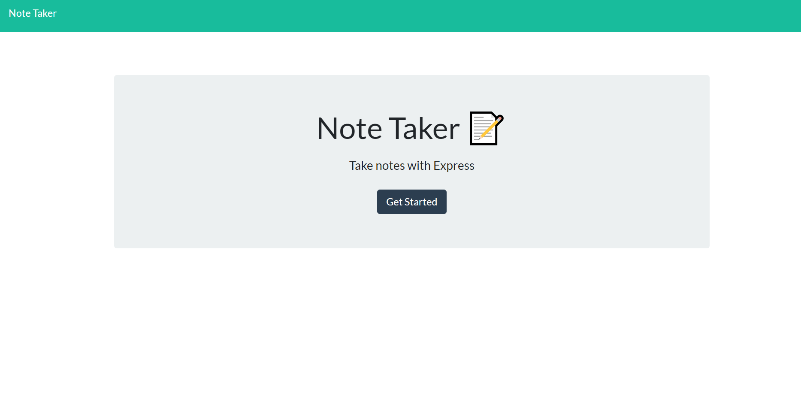
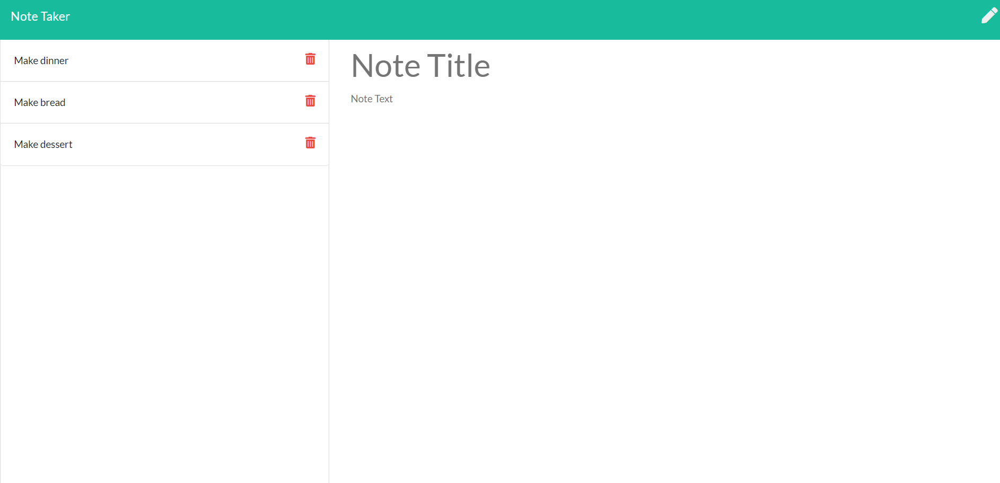

# Note Taker

## Description

The Note Taker application was created in order to help organize a list of notes from a user. After navigating through the homepage, the user is able to enter a note title and description, and then save the note to a list. This list will persist even if the server restarts. Any note can be revisited by clicking on the saved note, or deleted.

## Images 
  
 

## Installation
    Node, NPM install inquirer, express, uuid
## Usage
    for personal use, run "node server.js" in the command line
## License
    none
## Contributors
    Joanna Grosshans, creator
## Tests
    none
## Links
https://shrouded-reef-18833.herokuapp.com/
## Questions
jgrossh2  
[GitHub](https://github.com/jgrossh2/note-taker)  
Please contact <joannagrosshans2@gmail.com> for additional Information.

# Technologies used
* HTML 
* CSS 
* JS  
* Node  
* Express
